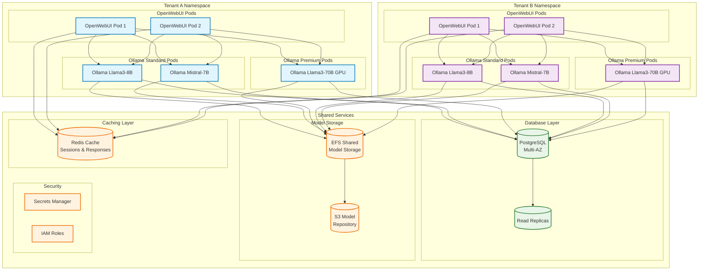
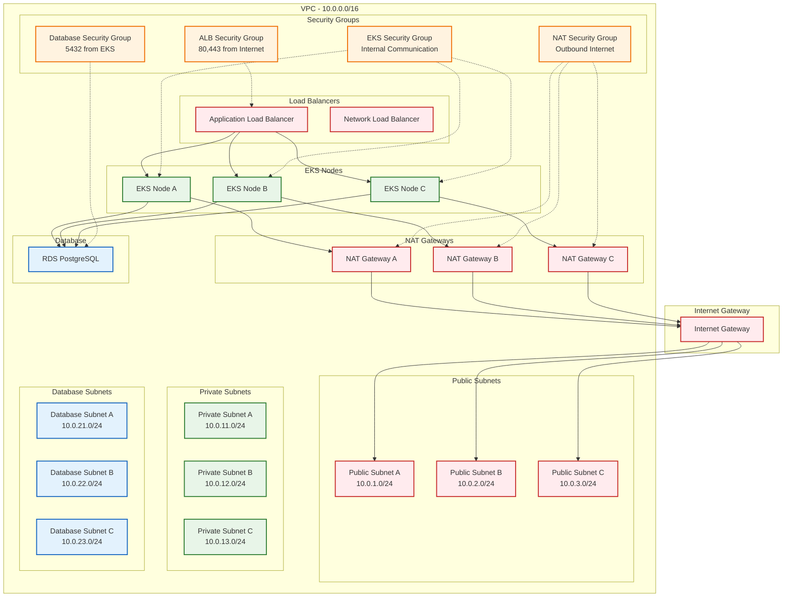
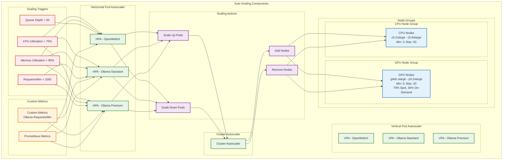
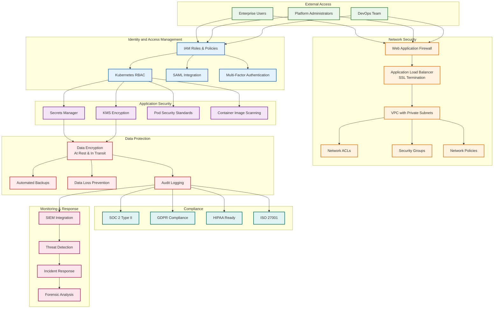

# SaaS Architecture Diagram

## High-Level Architecture

```mermaid
graph TB
    subgraph "Internet"
        Users[Enterprise Users]
        Admin[Platform Admins]
    end
    
    subgraph "AWS Cloud - us-east-1"
        subgraph "VPC - 10.0.0.0/16"
            subgraph "Public Subnet - 10.0.1.0/24"
                ALB[Application Load Balancer]
                NLB[Network Load Balancer]
                NAT[NAT Gateway]
            end
            
            subgraph "Private Subnet AZ-A - 10.0.2.0/24"
                subgraph "EKS Cluster"
                    subgraph "CPU Node Group"
                        CPU1[CPU Node 1]
                        CPU2[CPU Node 2]
                        CPU3[CPU Node 3]
                    end
                    
                    subgraph "GPU Node Group"
                        GPU1[GPU Node 1]
                        GPU2[GPU Node 2]
                        GPU3[GPU Node 3]
                    end
                    
                    subgraph "Control Plane"
                        API[Kubernetes API]
                        Scheduler[Kubernetes Scheduler]
                    end
                end
            end
            
            subgraph "Private Subnet AZ-B - 10.0.3.0/24"
                subgraph "EKS Cluster AZ-B"
                    CPUB1[CPU Node AZ-B]
                    CPUB2[CPU Node AZ-B]
                    GPUB1[GPU Node AZ-B]
                end
            end
            
            subgraph "Private Subnet AZ-C - 10.0.4.0/24"
                subgraph "EKS Cluster AZ-C"
                    CPUC1[CPU Node AZ-C]
                    CPUC2[CPU Node AZ-C]
                    GPUC1[GPU Node AZ-C]
                end
            end
            
            subgraph "Database Subnet Group"
                RDS[(RDS PostgreSQL<br/>Multi-AZ)]
                RDSRead[(Read Replica)]
            end
            
            subgraph "Storage"
                EFS[(Amazon EFS<br/>Model Storage)]
                S3[(Amazon S3<br/>Backup & Models)]
            end
            
            subgraph "Caching"
                Redis[(ElastiCache Redis<br/>Session Cache)]
            end
            
            subgraph "Monitoring"
                Prometheus[Prometheus]
                Grafana[Grafana]
                CloudWatch[CloudWatch]
            end
        end
        
        subgraph "AWS Services"
            Secrets[Secrets Manager]
            IAM[IAM Roles]
            KMS[KMS Encryption]
        end
    end
    
    subgraph "AWS Cloud - us-west-2 (DR)"
        subgraph "DR VPC"
            RDSDR[(RDS Read Replica)]
            S3DR[(S3 Cross-Region)]
            EFSDR[(EFS Replication)]
        end
    end
    
    %% Connections
    Users --> ALB
    Admin --> ALB
    ALB --> CPU1
    ALB --> CPU2
    ALB --> CPU3
    ALB --> GPU1
    ALB --> GPU2
    ALB --> GPU3
    
    CPU1 --> RDS
    CPU2 --> RDS
    CPU3 --> RDS
    GPU1 --> RDS
    GPU2 --> RDS
    GPU3 --> RDS
    
    CPU1 --> EFS
    CPU2 --> EFS
    CPU3 --> EFS
    GPU1 --> EFS
    GPU2 --> EFS
    GPU3 --> EFS
    
    CPU1 --> Redis
    CPU2 --> Redis
    CPU3 --> Redis
    GPU1 --> Redis
    GPU2 --> Redis
    GPU3 --> Redis
    
    Prometheus --> CPU1
    Prometheus --> CPU2
    Prometheus --> CPU3
    Prometheus --> GPU1
    Prometheus --> GPU2
    Prometheus --> GPU3
    
    RDS --> RDSRead
    RDS --> RDSDR
    S3 --> S3DR
    EFS --> EFSDR
    
    %% Styling
    classDef aws fill:#ff9900,stroke:#232f3e,stroke-width:2px,color:#fff
    classDef k8s fill:#326ce5,stroke:#fff,stroke-width:2px,color:#fff
    classDef database fill:#336791,stroke:#fff,stroke-width:2px,color:#fff
    classDef storage fill:#ff6b35,stroke:#fff,stroke-width:2px,color:#fff
    classDef monitoring fill:#ff6b6b,stroke:#fff,stroke-width:2px,color:#fff
    
    class ALB,NLB,NAT,RDS,RDSRead,RDSDR,S3,S3DR,EFS,EFSDR,Redis,Secrets,IAM,KMS,CloudWatch aws
    class CPU1,CPU2,CPU3,GPU1,GPU2,GPU3,API,Scheduler,CPUB1,CPUB2,GPUB1,CPUC1,CPUC2,GPUC1 k8s
    class Prometheus,Grafana monitoring
```



## Application Architecture Detail



## Network Architecture



## Auto-Scaling Architecture



## Monitoring and Observability

```mermaid
graph TB
    subgraph "Data Collection"
        subgraph "Application Metrics"
            AppMetrics[OpenWebUI Metrics<br/>- Request latency<br/>- Error rates<br/>- User sessions]
            OllamaMetrics[Ollama Metrics<br/>- Model loading time<br/>- Inference latency<br/>- GPU utilization<br/>- Memory usage]
        end
        
        subgraph "Infrastructure Metrics"
            K8sMetrics[Kubernetes Metrics<br/>- Pod status<br/>- Node resources<br/>- Network traffic]
            AWSMetrics[AWS Metrics<br/>- EC2 instances<br/>- RDS performance<br/>- EFS usage<br/>- ElastiCache stats]
        end
        
        subgraph "Business Metrics"
            TenantMetrics[Tenant Usage<br/>- Active users<br/>- API calls<br/>- Model requests<br/>- Resource consumption]
        end
    end
    
    subgraph "Data Processing"
        Prometheus[Prometheus<br/>Metrics Collection]
        Fluentd[Fluentd<br/>Log Aggregation]
        Jaeger[Jaeger<br/>Distributed Tracing]
    end
    
    subgraph "Storage"
        TSDB[Prometheus TSDB]
        Elasticsearch[Elasticsearch<br/>Log Storage]
        S3[S3<br/>Long-term Storage]
    end
    
    subgraph "Visualization"
        Grafana[Grafana<br/>Dashboards]
        Kibana[Kibana<br/>Log Analysis]
        JaegerUI[Jaeger UI<br/>Trace Analysis]
    end
    
    subgraph "Alerting"
        AlertManager[Alert Manager]
        PagerDuty[PagerDuty]
        Slack[Slack Notifications]
        Email[Email Alerts]
    end
    
    subgraph "CloudWatch"
        CloudWatch[CloudWatch<br/>AWS Native Monitoring]
        XRay[X-Ray<br/>AWS Distributed Tracing]
    end
    
    %% Data Flow
    AppMetrics --> Prometheus
    OllamaMetrics --> Prometheus
    K8sMetrics --> Prometheus
    AWSMetrics --> CloudWatch
    TenantMetrics --> Prometheus
    
    Prometheus --> TSDB
    Fluentd --> Elasticsearch
    Jaeger --> S3
    
    TSDB --> Grafana
    Elasticsearch --> Kibana
    S3 --> JaegerUI
    CloudWatch --> Grafana
    XRay --> JaegerUI
    
    Prometheus --> AlertManager
    CloudWatch --> AlertManager
    
    AlertManager --> PagerDuty
    AlertManager --> Slack
    AlertManager --> Email
    
    %% Styling
    classDef collection fill:#e8f5e8,stroke:#2e7d32,stroke-width:2px
    classDef processing fill:#e3f2fd,stroke:#1565c0,stroke-width:2px
    classDef storage fill:#fff3e0,stroke:#ef6c00,stroke-width:2px
    classDef visualization fill:#f3e5f5,stroke:#7b1fa2,stroke-width:2px
    classDef alerting fill:#ffebee,stroke:#c62828,stroke-width:2px
    classDef aws fill:#ff9900,stroke:#232f3e,stroke-width:2px,color:#fff
    
    class AppMetrics,OllamaMetrics,K8sMetrics,AWSMetrics,TenantMetrics collection
    class Prometheus,Fluentd,Jaeger processing
    class TSDB,Elasticsearch,S3 storage
    class Grafana,Kibana,JaegerUI visualization
    class AlertManager,PagerDuty,Slack,Email alerting
    class CloudWatch,XRay aws
```

## Security Architecture


