# OpenWebUI + Ollama Architecture Diagram

## System Overview

This diagram illustrates the production deployment architecture of the OpenWebUI + Ollama platform with monitoring and security components.

```mermaid
graph TB
    %% External Access
    User[👤 User] --> LB[🌐 Load Balancer<br/>157.180.80.91]
    
    %% Ingress Layer
    LB --> Ingress[🔀 NGINX Ingress Controller<br/>SSL Termination<br/>Let's Encrypt]
    
    %% Application Layer
    Ingress --> OpenWebUI[🤖 OpenWebUI<br/>AI Chat Interface<br/>Port: 8080]
    Ingress --> Grafana[📊 Grafana<br/>Monitoring Dashboard<br/>Port: 3000]
    Ingress --> Prometheus[📈 Prometheus<br/>Metrics Collection<br/>Port: 9090]
    
    %% AI/ML Layer
    OpenWebUI --> Ollama1[🧠 Ollama Instance 1<br/>Llama3-8B Model<br/>Port: 11434]
    OpenWebUI --> Ollama2[🧠 Ollama Instance 2<br/>Llama3-8B Model<br/>Port: 11434]
    
    %% Data Layer
    OpenWebUI --> PostgreSQL[🗄️ PostgreSQL<br/>Chat History & Metadata<br/>Port: 5432]
    
    %% Monitoring Data Flow
    Prometheus --> Ollama1
    Prometheus --> Ollama2
    Prometheus --> PostgreSQL
    Prometheus --> OpenWebUI
    Grafana --> Prometheus
    
    %% Infrastructure
    subgraph "Kubernetes Cluster (k3s)"
        subgraph "openwebui namespace"
            OpenWebUI
        end
        
        subgraph "ollama namespace"
            Ollama1
            Ollama2
        end
        
        subgraph "database namespace"
            PostgreSQL
        end
        
        subgraph "monitoring namespace"
            Grafana
            Prometheus
        end
        
        subgraph "ingress-nginx namespace"
            Ingress
        end
    end
    
    %% Security & SSL
    subgraph "Security Layer"
        SSL[🔒 SSL/TLS Certificates<br/>Let's Encrypt<br/>Auto-renewal]
        Firewall[🛡️ UFW Firewall<br/>Ports: 22, 80, 443, 6443]
    end
    
    %% CI/CD Pipeline
    subgraph "CI/CD Pipeline"
        GitHub[📦 GitHub Repository<br/>Source Code]
        Actions[⚙️ GitHub Actions<br/>Automated Deployment]
        Secrets[🔐 GitHub Secrets<br/>SSH Key Management]
    end
    
    GitHub --> Actions
    Actions --> Secrets
    Actions --> LB
    
    %% Styling
    classDef userClass fill:#e1f5fe,stroke:#01579b,stroke-width:2px
    classDef appClass fill:#f3e5f5,stroke:#4a148c,stroke-width:2px
    classDef dataClass fill:#e8f5e8,stroke:#1b5e20,stroke-width:2px
    classDef monitorClass fill:#fff3e0,stroke:#e65100,stroke-width:2px
    classDef securityClass fill:#ffebee,stroke:#c62828,stroke-width:2px
    classDef cicdClass fill:#f1f8e9,stroke:#33691e,stroke-width:2px
    
    class User userClass
    class OpenWebUI,Ollama1,Ollama2 appClass
    class PostgreSQL dataClass
    class Grafana,Prometheus monitorClass
    class SSL,Firewall securityClass
    class GitHub,Actions,Secrets cicdClass
```

## Component Details

### 🌐 **External Access**
- **Load Balancer**: Single IP (157.180.80.91) serving all traffic
- **SSL Termination**: Let's Encrypt certificates with automatic renewal
- **Domain Routing**: 
  - `devops-ricardovaldez.darienc.com` → OpenWebUI
  - `devops-monitor-ricardovaldez.darienc.com` → Monitoring

### 🤖 **AI/ML Layer**
- **OpenWebUI**: Web interface for AI chat interactions
- **Ollama Instances**: 2 replicas for high availability
- **Model**: Llama3-8B running locally on the server
- **Load Balancing**: Automatic failover between Ollama instances

### 🗄️ **Data Layer**
- **PostgreSQL**: Persistent storage for chat history and user metadata
- **Database**: `openwebui` with user authentication and chat logs
- **Backup**: Automated backups with retention policies

### 📊 **Monitoring Stack**
- **Prometheus**: Metrics collection from all services
- **Grafana**: Visualization and alerting dashboards
- **Metrics**: System performance, application health, resource usage
- **Alerts**: Automated notifications for critical issues

### 🔒 **Security Features**
- **SSL/TLS**: End-to-end encryption for all communications
- **Firewall**: UFW configured with minimal required ports
- **Authentication**: OpenWebUI user management with admin controls
- **Secrets Management**: SSH keys stored in GitHub Secrets
- **Network Security**: Internal service communication within cluster

### ⚙️ **CI/CD Pipeline**
- **GitHub Actions**: Automated deployment on code changes
- **Security**: SSH keys managed through GitHub Secrets
- **Testing**: Comprehensive test suite with 7 phases
- **Deployment**: Zero-downtime updates with health checks

## Network Flow

1. **User Request** → Load Balancer → NGINX Ingress
2. **SSL Termination** → Route to appropriate service
3. **OpenWebUI** → Process chat request → Query Ollama
4. **Ollama** → Generate AI response → Return to OpenWebUI
5. **Database** → Store chat history and user data
6. **Monitoring** → Collect metrics → Display in Grafana

## High Availability Features

- **Ollama Replicas**: 2 instances for failover
- **Health Checks**: Liveness and readiness probes
- **Auto-restart**: Failed pods automatically restarted
- **Load Balancing**: Traffic distributed across healthy instances
- **Monitoring**: Real-time health monitoring and alerting

## Security Architecture

- **Network Isolation**: Services communicate within Kubernetes cluster
- **SSL/TLS**: All external traffic encrypted
- **Authentication**: User management with role-based access
- **Secrets**: Sensitive data stored securely in GitHub Secrets
- **Firewall**: Minimal port exposure with UFW rules
